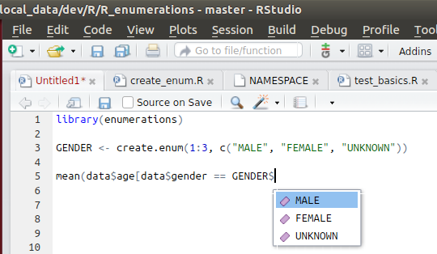

# Enumerations in R

## Overview

This package adds a dynamic enumeration data type to the R programming language

An enumeration is a data type that consists of a set of named values (value/name pairs)
to restrict the allowed values and support using self-explanatory names instead
of magic values in the code.

"Dynamic" means the enumeration values cannot only be declared at "compile" (design) time
but also during run-time.


## Background

For a good definition and background information about *enumeration types* see wikipedia:

https://en.wikipedia.org/wiki/Enumerated_type


## Advantages of enumerations

Enumerated types

1. make the code **more self-documenting** by using self-explanatory constant names instead of "magic" values
2. reduce the risk of passing wrong actual parameter values to functions via **validation against
   the list of allowed values of the enumeration**
3. **make coding easier** if the IDE supports code completion (e. g. RStudio)
   by presenting the list of allowed names in the editor


## Installation

To install the package using the source code at github you can use the package *devtools*:

```R
# install.packages("devtools")
devtools::install_github("aryoda/R_enumerations")
```


## Examples

There are different ways of creating an enumeration object:

```R
library(enumerations)

# This is the easiest way to create an enumeration (if the enum values are not important)
DRINKS <- create.enum(c("COFFEE", "TEA", "SOFT DRINK"))

# This is the most intuitive way of creating an enumeration to create names of meaningful values
COLOR.ENUM <- create.enum(c(BLUE = 1L, RED = 2L, BLACK = 3L))

# You can specify the values and names separately (e. g. if they come from a CSV file or database table)
COLOR.ENUM <- create.enum(c(1L, 2L, 3L), c("BLUE", "RED", "BLACK"))
```


### Magic numbers vs. enumerations

```R
library(enumerations)

# "magic numbers" vs. a self-explanatory enumeration --------------------------------------------------------------

data <- data.frame(gender = c(1, 2, 1, 3, 4, 2), age = c(50, 40, 10, 10, 18, 25))

GENDER <- create.enum(1:3, c("MALE", "FEMALE", "UNKNOWN"))


# Example with a "magic number" (what does "1" mean?):
mean(data$age[data$gender == 1])

# Same example with an enum that makes the meaning explicit:
mean(data$age[data$gender == GENDER$MALE])


# check against allowed values to find invalid data ---------------------------------------------------------------

data[!(data$gender %in% GENDER),]
#    gender  age
# 5       4   18
```


### Enum-alike function arguments

You can use an enumeration as data type of a function parameter

- to document the allowed values of a function parameter and
- check the passed actual parameter value against the list of allowed values
- support optional parameters (the first enum value is the default value then)

```R
library(enumerations)

GENDER <- create.enum(1:3, c("MALE", "FEMALE", "UNKNOWN"))

life.expectancy <- function(x = GENDER) {

  x.value <- match.enum.arg(x)  # validate against allowed values and pass the default value if no value was passed
  
  if (x.value == GENDER$MALE)
    return(78)
  if (x.value == GENDER$FEMALE)
    return(80)
    
  return(NA)
}

life.expectancy()   # uses the first element of the enum as default value!
# [1] 78
life.expectancy(GENDER$MALE)
# [1] 78
life.expectancy(GENDER$FEMALE)
# [1] 80
life.expectancy(GENDER$UNKNOWN)
# [1] NA
life.expectancy(1)   # passing the value is not the recommended way, but also works
# [1] 78
life.expectancy(4)   # passing the value is not the recommended way... because you may use invalid values
# Error in match.enum.arg(x) : 
#    'arg' must be one of the values in the 'choices' list: MALE = 1, FEMALE = 2, UNKNOWN = 3 
life.expectancy("male")   # names as strings do not work directly
# Error in match.enum.arg(x) : 
#    'arg' must be one of the values in the 'choices' list: MALE = 1, FEMALE = 2, UNKNOWN = 3 
life.expectancy(GENDER[["MALE"]])    # names as strings must use the usual double-bracket syntax
# [1] 78
gender <- "MALE"
life.expectancy(GENDER[[gender]])    # a string in a variable must also use the double-brackets
# [1] 78
```

**Note** that currently there is no support for another than the first enum value as the default value
in case of a missing actual parameter.


### Code completion ("intellisense")

Using an enum type does also enable code completion in RStudio (and other IDEs):




## Use enumerations in your own packages

### Import into your own packages

If you want to use this package in your own packages you have to declare the dependencies in the
`DESCRIPTION` file and add a remote dependency to the github location:

```
Imports: ...,
         enumerations

Remotes: aryoda/R_enumerations
```

Note that the remote dependency does not cause the automatic installation of the referenced package.
You still have to [install it manually](#installation) beforehand.

For details see: https://stackoverflow.com/questions/30493388/create-an-r-package-that-depends-on-another-r-package-located-on-github


### Best practices to use enumerations in your own package

TODO

* public enum via roxygen2/namespace export + Documentation
* FQN in function signatures
